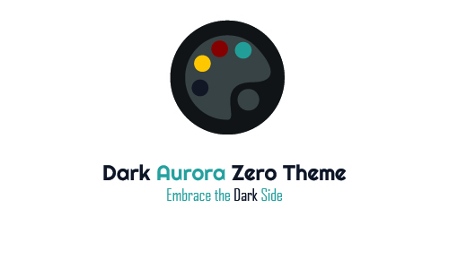

<h1 style="color: #ffff" align = "center">Dark Night Zero</h1>

<!--  -->

A clean and elegant Dark Theme for all of you VS Code enthusiasts. Thank you for checking out my theme.

<h2 style="color: #028090">Installation :</h2>

1. Open the extension bar on VS Code
2. Search for **_Dark Night Zero Theme_**
3. Click _Install_
4. Reload your editor
 <h2 style="color: #028090">Activate Theme :</h2>

Launch Quick Open:

-   **Linux** : Ctrl + Shift + P
-   **macOS** : ⌘ + Shift + P
-   **Windows** : Ctrl + Shift + P

    Type '**theme**', choose '**Preferences: Color Theme**', and choose **_Dark Night Zero_**

### For more information

**Enjoy!**
